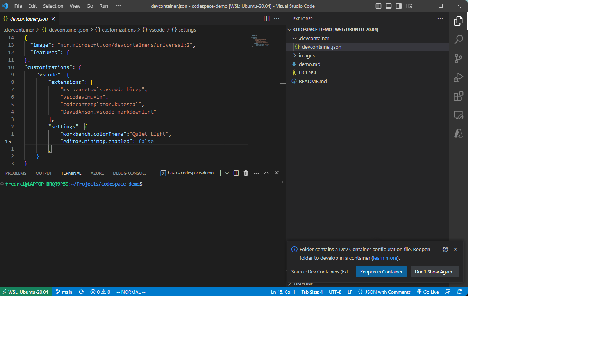
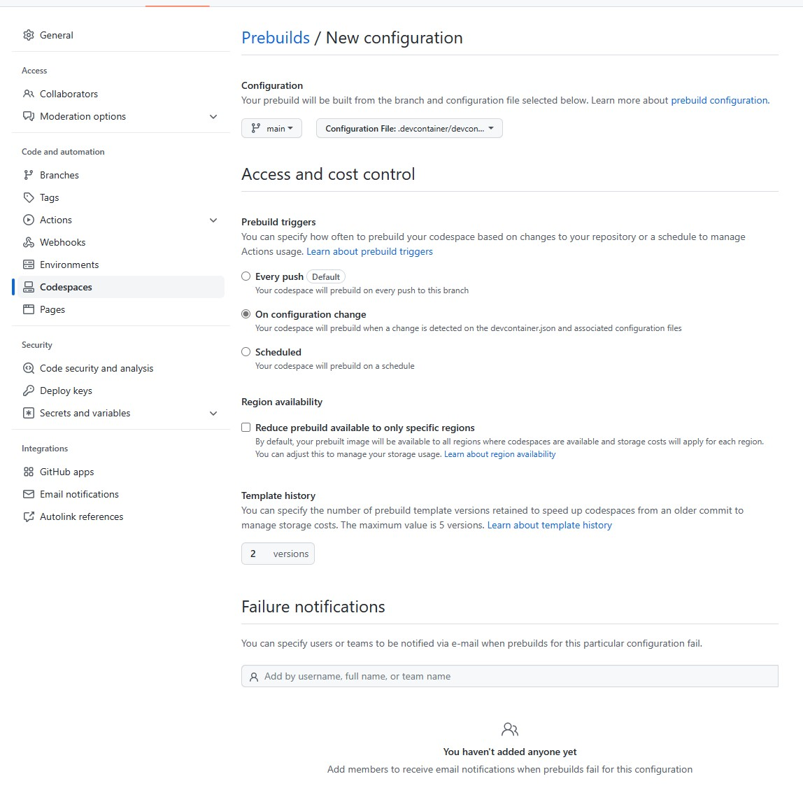

# Codespace Demo

Small repo showing how to enable vs code plugins in your dev container togheter with some script initialization. The repo shows setting up a set of tools typically used in CNCF projects.

I could have instead of the script created a Dockerfile with the same content, but I wanted to show how to use the script.

## WSL 2

By installing Docker with the WSL 2 integration you can clone this repo into a WSL 2 directory, and when you open it VS Code will prompt you to start it in the devcontainer. The good part of this setup is that you can still control your git locally with GPG, aliases etc.

## Prebuild setting

This repo also has prebuilds enabled to speed up initialization:

